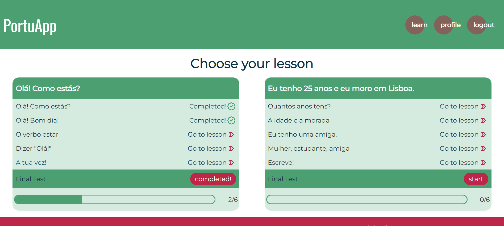
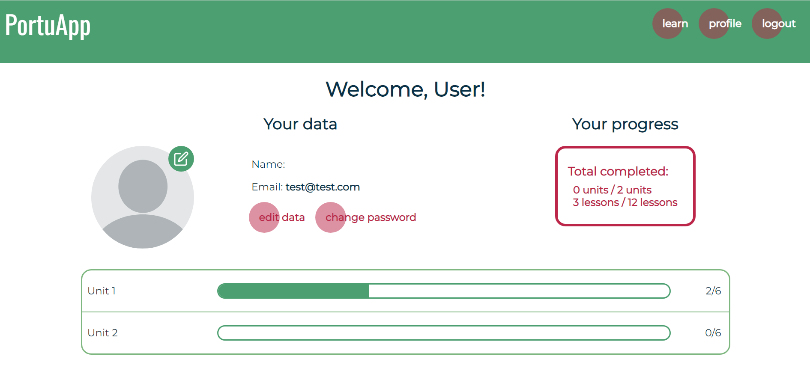
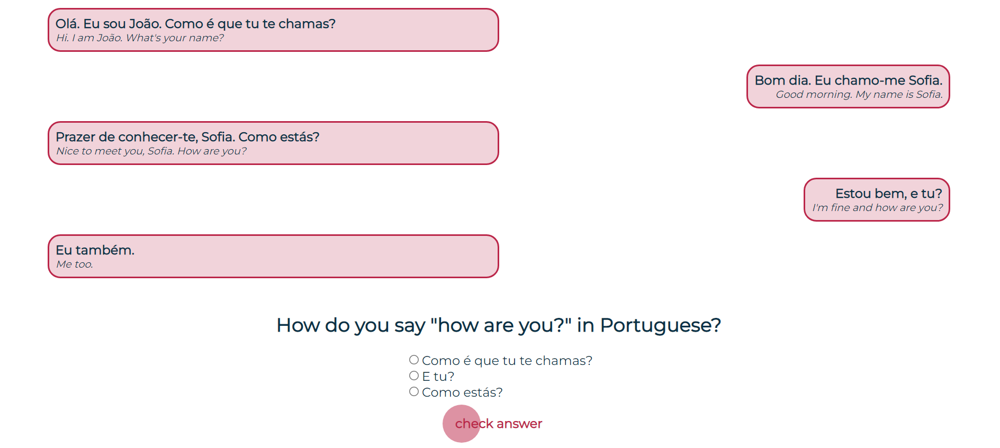
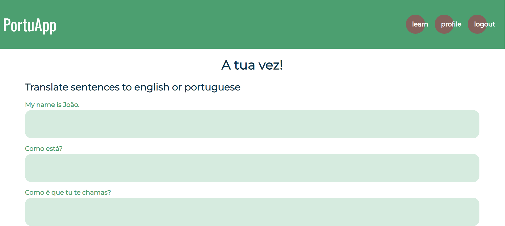
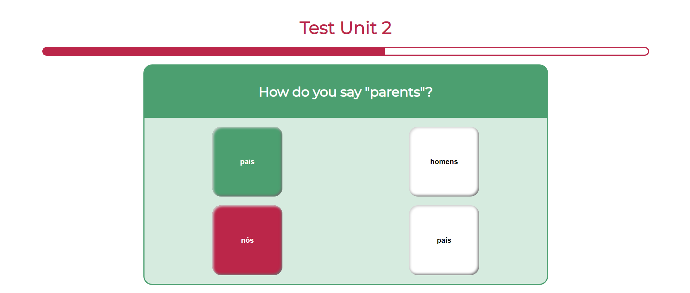
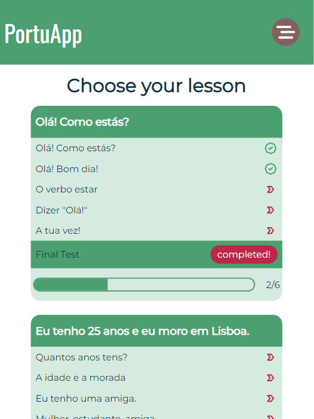
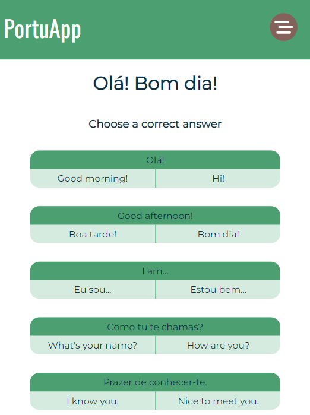
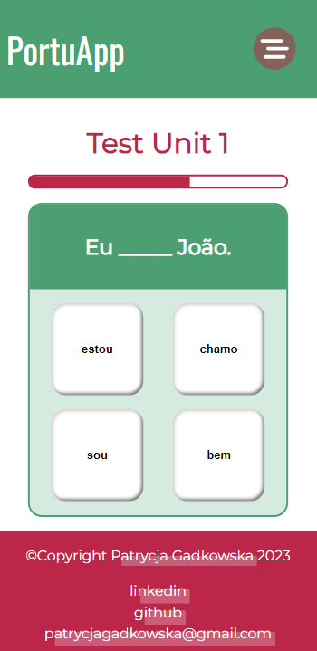

# Overview

PortuApp is a demo application created with React with a use of React Router, React Icons and Firebase.

Project contains Home Page and Authorization Page to sign in and sign up. For logged in user there are 4 more pages: Learn with all units and lessons, Lesson containing lesson content and exercise, Test with a quiz checking up knowledge from whole unit and Profile containing informations about user, his progress in learning and forms to change his data/password. There are 5 types of lessons: Dialogue, Flashcard, Translate, Connect and Conjugation.

This project uses Firestore Database from Firebase to get units data and also to get and send user's progress data. Authentication is also done with a use of Firebase.

## Demo

Demo available <a href="https://portuapp.netlify.app">here!</a>

## Install

```
git clone https://github.com/patrycjagadkowska/PortuApp.git
cd PortuApp
npm install
```

## Starting development

Starting the app in the ```dev``` development

```
npm start
```

## Techs/frameworks used

- React v18.2
- React Router v6.10
- Firebase v9.19.1

## Contact

Feel free to contact me by email <a href="mailto:patrycjagadkowska@gmail.com">patrycjagadkowska@gmail.com</a> or on <a href="https://www.linkedin.com/in/patrycja-gadkowska-600b34154/">linkedin</a>

## Screenshots

<section style="text-align: center">
<h3> Desktop view of Learn page containing all units and links to lessons and test. </h3>

<h3> Screenshot of the desktop view of Profile page with user's personal data and his progress overview. </h3>

<h3> Screenshot of the desktop view of Lesson page with lesson's type dialogue. </h3>

<h3> Screenshot of the desktop view of Lesson page with lesson's type Translate. </h3>

<h3> Screenshot of the desktop view of Test page. </h3>

<h3> Screenshot of the tablet view of Learn page. </h3>
<p align="center"></p>
<h3> Screenshot of the tablet view of Lesson page with lesson's type flashcard </h3>
<p align="center"></p>
<h3> Screenshot of the mobile view of Test page. </h3>
<p align="center"></p>
</section>

### Source of images used in this project:

- [Home page, photo of student with tablet](https://www.pexels.com/pl-pl/zdjecie/zdjecie-osoby-trzymajacej-tablet-3060661/)
- [Two people, one with smartphone and the other with tablet](https://www.pexels.com/pl-pl/zdjecie/smartfon-kobiety-przegladanie-internet-6205512/)
- [Man next to the window holding phone in his hand](https://www.pexels.com/pl-pl/zdjecie/mezczyzna-w-czerwonej-koszuli-z-okraglym-dekoltem-trzymajac-smartfon-obok-kobiety-w-bialym-podkoszulku-bez-rekawow-6140463/)
- [Man with phone showing something to woman](https://www.pexels.com/pl-pl/zdjecie/mezczyzna-w-czerwonej-koszuli-z-okraglym-dekoltem-trzymajac-smartfon-obok-kobiety-w-bialym-podkoszulku-bez-rekawow-6140463/)
- [People in circle](https://easyvectors.com/download/community-team-teamwork-people-1404)
- [Laptop](https://easyvectors.com/download/laptop-notebook-computer-black-1723)
- [Profile page, blank profile picture](https://easyvectors.com/download/blank-profile-picture-mystery-man-418)
